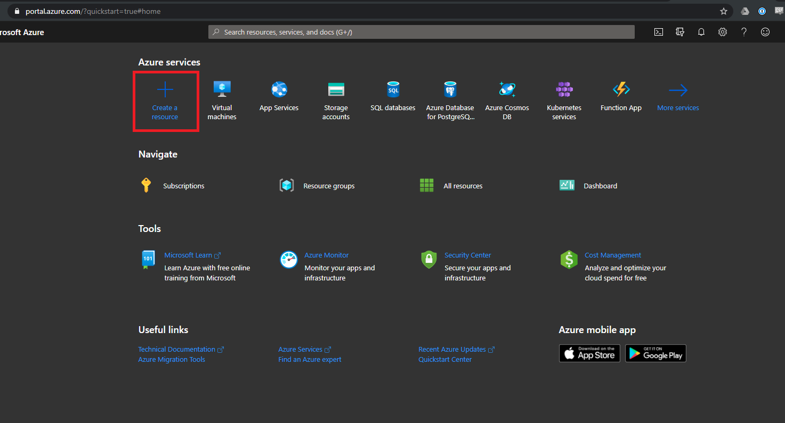
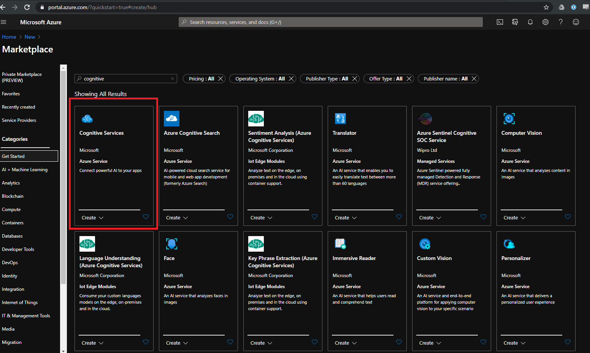
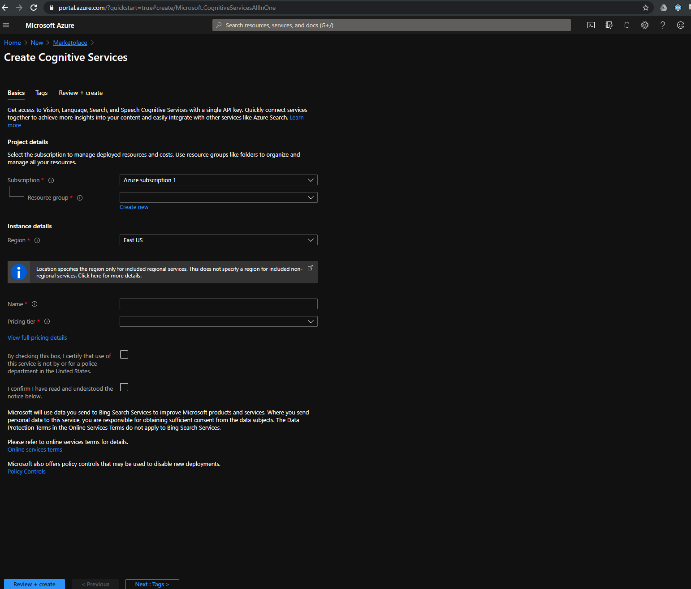
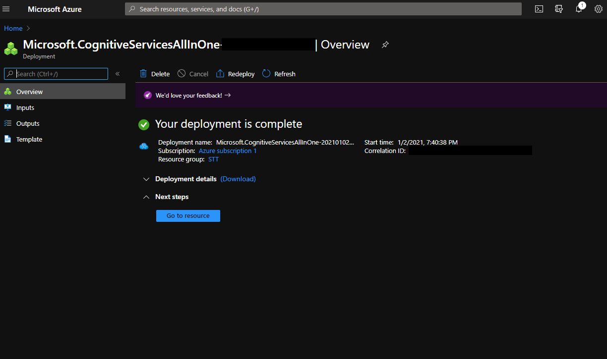
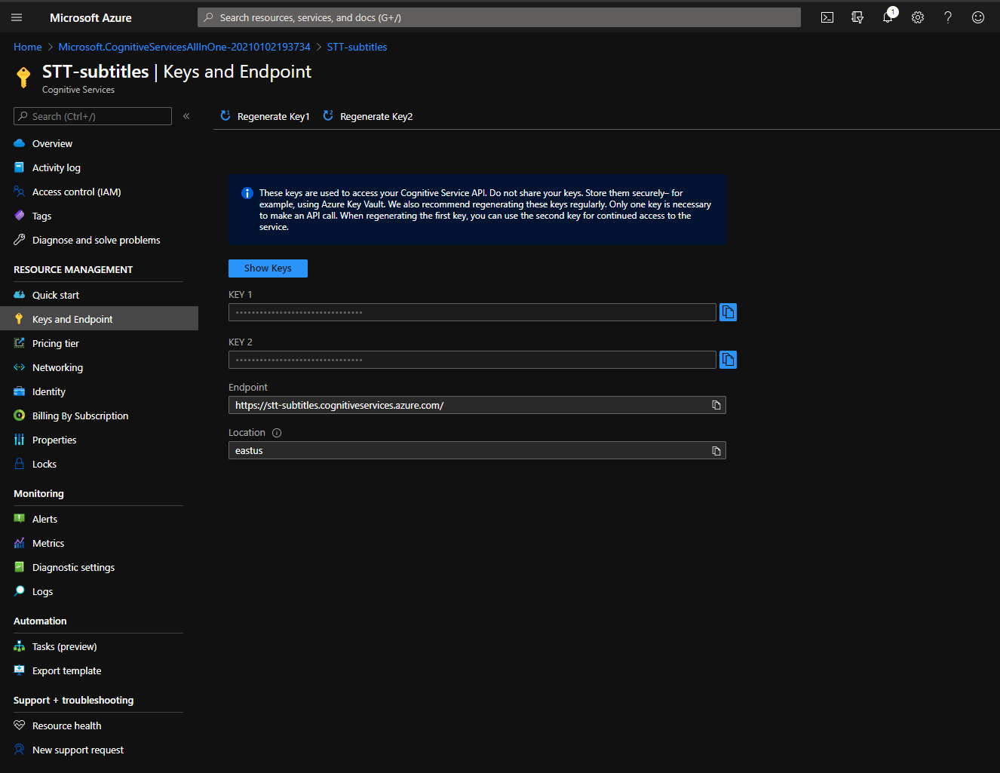
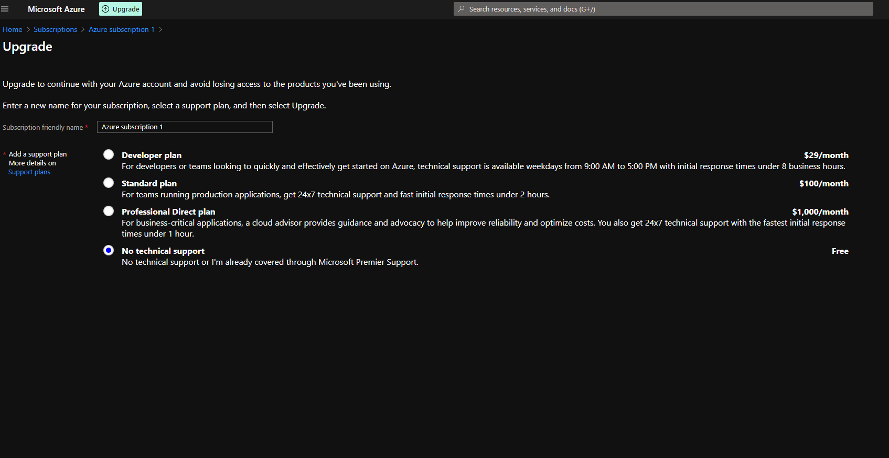
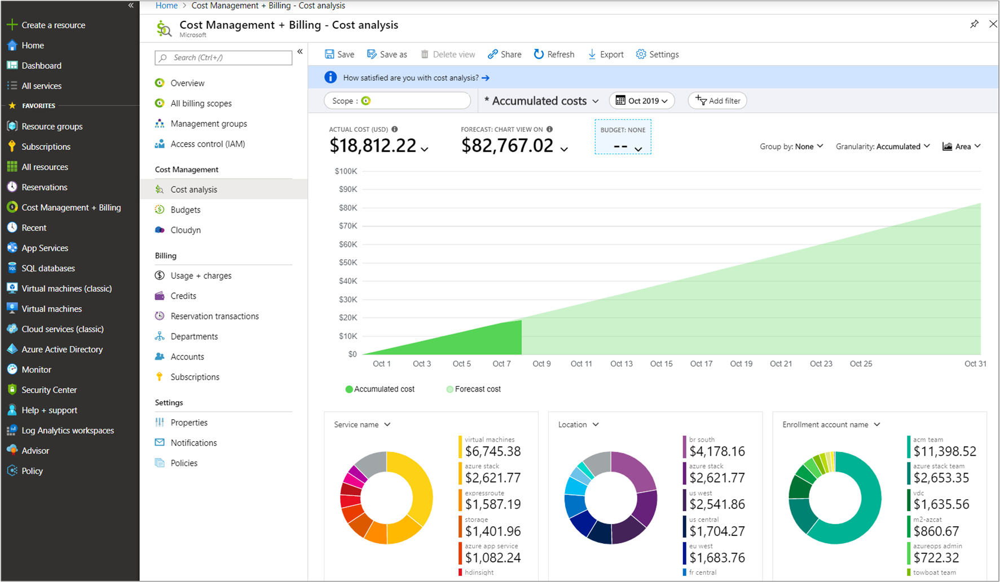

# How to sign up for Microsoft Azure and obtain an API Key

An Azure Cognitive Services API Key is needed to access the STT service. 

It is free to sign up, and the account will not be charged unless upgraded to a paid tier. A new account has a $200 credit for the first month. After which, every service is pay-as-you-go meaning you only pay for what you use.

For more information regarding Cognitive Services & Pricing:

https://azure.microsoft.com/en-us/pricing/details/cognitive-services/speech-services/ *Currently the standard STT service costs $1 per audio hour.

 

## Step 1 - Create an Azure account

Create an Azure account here: https://azure.microsoft.com/en-us/free/

 

## Step 2 - Create a Cognitive Service Resource

Navigate to the portal homepage by clicking the Home button or navigate here: https://portal.azure.com/

Search for "Cognitive" and create the first one titled "Coginitive Services".

Fill in the information as needed.

Notes: 
- Click "Create New" for resource group and name your resource group. This can be anything, such as "STT-Group".
- Select a region that is close to you. 

Click "Review + Create". On the next page, click "Deploy" and wait for the deployment to complete.

When finished, click "Go to Resource".

On the Resource page, click "Keys and Endpoint" in the left bar.

Copy the first key and paste it into the STT tool along with the location (region). You should now be able to connect to the Azure STT service!

 

## Upgrading Account for Continued Usage
 

> Azure will not bill you unless you upgrade your account. STT will not work on a free tier account after the first month. To do so, click upgrade at the top left of the portal. Typically, the average user will not want technical support.

Once upgraded, Azure records STT usage chages typically a couple days after they occur. You will be billed for the amount used at the end of the month.

 

## Viewing Cost and Billing

From the homepage, click on "Cost Management" then "Cost analysis" on the left tab.

The graph will display accumulated resource costs for the billing period, with a forcast of what it thinks the rest of the billing period will cost.

