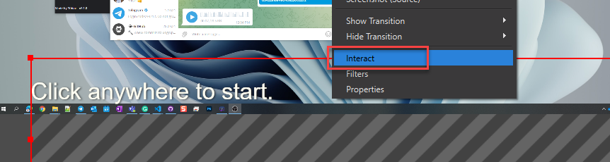
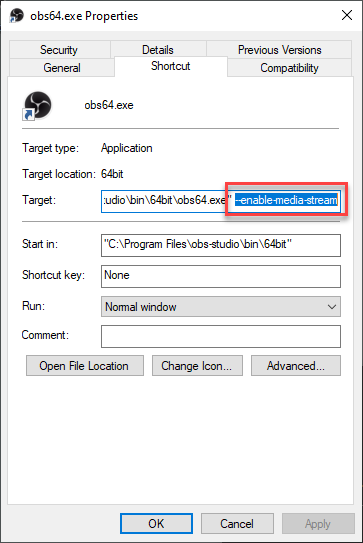

# OBS STT Subtitles using Microsoft Azure Cognitive SDK

Welcome! This application presents Speech to Text subtitles that can be captured by OBS or other programs. It is powered by Microsoft's Cognitive STT service.

> :information_source: Note: The Microsoft Cognitive Service is not free and you will need to provide this program with a subscription key in order to use it. See more info here: <https://azure.microsoft.com/en-us/services/cognitive-services/speech-to-text/>

# Create an Azure Account and obtain a Cognitive Service API Key

See [these instructions](docs/azure-setup.md) to setup an Azure account and STT service Key.

 

# Download & Install

## Step 1 - Download the latest release

Download the electron app from the releases tab

## Step 2 - Extract files

Extract the files from the zip into a location on your hard drive.

## Step 3 - Run AzureSTTSubtitles.exe

Enter Azure key information and settings you would like. Don't forget to click Save.

# Setup Subtitles

 There are two options for running the subtitles depending on your capture program. Option 1 (browser source) is preferred, but does not work with streamlabs OBS.

## Option 1 - Add an OBS Browser Source (Works with OBS) *Recommended

### Step 1: Add a new browser source

- Enter the file location of the subtitles.html with `file:///` in front. I.e. `file:///C://AzureSTTSubtitles-win32-x64/resources/app/html/subtitles.html` or use the "Local File" option.
- Note: Local file can also be used though you will not be able to enter CSS within the URL. However, this is not typically an issue, as custom CSS can be applied in the accompanying app.
- Subtitles.html is located in the resources/app/html folder.
- Check the options for shutdown source when not visible and refresh the browser when the scene becomes active.
- In order to **click** and start the browser content, right-click browser source and select Interact to launch an interactive browser window.  
  

### Step 2: Add OBS launch parameter to OBS shortcut

Currently, the OBS browser source window does not support showing the alert to allow microphone access in order to accept it. This launch parameter will allow microphone access to the OBS browser sources.

OBS bug documented here: <https://obsproject.com/forum/threads/using-browser-as-source-camera-mic-not-blocked-but-crossed-out-camera-image-on-obs-screen.123776/>

1. Locate and right click on the shortcut you use to open OBS.
2. Select "Properties"
3. In the "Target" box, add `--enable-media-stream` to the very end. It should look similar to `"C:\Program Files (x86)\obs-studio\bin\64bit\obs64.exe" ----enable-media-stream`  
  

> :information_source: Make sure to start OBS with this shortcut for the subtitles to work. If the subtitle program cannot access your microphone, a message will display after 15 seconds regarding this step.
>
> :warning: Do not use the "Start Subtitles" button in the app if using a browser source. It is only used for option 2 (window capture). The browser source can just be visibility toggled for subtitles.

 

## Option 2 - Add an OBS Window Capture (Works with Streamlabs OBS)

### Step 1: Add a window capture

- Click "Start Subtitles" in the subtitle program.
- Add a new window capture source in OBS and select the subtitle window titled "OBS STT Subtitles - Azure"
- Uncheck "Capture Cursor"

### Step 2: Add a Color Key Filter

- In order to make the subtitle window transparent, you can add a color key filer for whichever color you chose the background color of the subtitles to be. Default is transparent so try using blue or green.
- Adjust the similarity and softness until the subtitles appear cleanly without background color.

> :information_source: Remember to close the application or source when not in use to save the cost of being connected to the STT service.

  

# Additional Customizations

## Blacklist Words

Blacklisted words will be replaced with asterisk characters. Enter them in the blacklist field with comma seperation.

Blacklisted words support wildcards (*) which will match any characters where it is placed in the word.

Example:
> :information_source: `*rap` will match `rap` and `trap`, but not `rapping` or `trapping`.
>
>Using `*rap*` will match any word with the phrase `rap` in it such as `trapping`.

 

## (Advanced) Change Font Style via URL when using browser source

Custom font style can easily be applied using the input field in the application, but there is an additional override available for those that want it. This is mainly available for those that want to copy their pubnub URL style css without URI decoding it.
The font style can be applied via the URL of the browser source. This will take priority over the style input in the application.

The css must be URL encoded if put in the url. You can use a tool such as <https://www.urlencoder.org/> to convert it, or just use the input field in the application instead without needing encoding.

Examples:

- Set Style: `?style=CSS_HERE`
- Set Background White: `?style=background%3Awhite%3B`
- Set Font Red: `?style=color%3Ared%3B`
- Set Text Padding: `?style=padding%3A10px%3B`

Here are some pre-built options to try:

- Clean: .../subtitles.html?style=color%3Argba(0%2C0%2C0%2C.9)%3Btext-shadow%3A0%200%205px%20%23fff%3B
- CC Caption: .../subtitles.html?style=background%3A%23000%3Bfont-weight%3A600%3Btext-transform%3Auppercase%3Btext-shadow%3Anone%3Bpadding%3A10px%3B
- Rainbow: .../subtitles.html?style=background%3Alinear-gradient(to%20right%2Corange%2C%23ff0%2Cgreen%2C%230ff%2C%2300f%2Cviolet)%20100%25%3B-webkit-background-clip%3Atext%3B-webkit-text-fill-color%3Atransparent%3Btext-shadow%3Anone%3B

 Here are the same styles without URL encoding that can be put into the Custom Subtitle CSS field of the application instead. If you have encoded CSS like above, then you can use a tool such as <https://www.urldecoder.org/> to decode it.

- Clean: `color:rgba(0,0,0,.9);text-shadow:0 0 5px #fff;`
- CC Caption: `background:#000;font-weight:600;text-transform:uppercase;text-shadow:none;padding:10px;`
- Rainbow: `background:linear-gradient(to right,orange,#ff0,green,#0ff,#00f,violet) 100%;-webkit-background-clip:text;-webkit-text-fill-color:transparent;text-shadow:none;`
